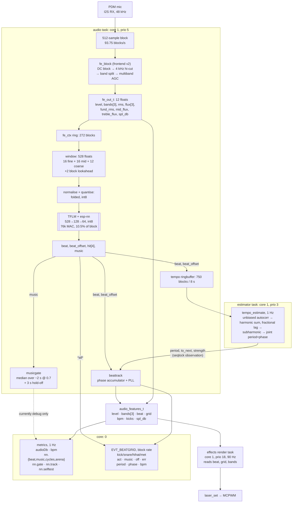

> [!CAUTION]
> This is not a manual! This repository serves as documentation only, use at your own risk.

# truecolors

This project captures a lot of embedded approaches I have picked up over the years and serves as my main ESP-IDF reference template for new projects that involve an embedded web UI w/ provisioning and OTA. 

Wide color gamut RGB Laser Mood Light  

I designed this light after growing fascinated with wide color gamut (110% BT.2020) rgb laser projectors. The colors are more vibrant and saturated than anything else. Even the best OLED screens look orange in comparison to the deep red produced by the almost monochromatic lasers.  
I got my hands on a Nichia NUMB12 Laser module, a very common module used in low to mid-tier RGB laser projectors.  
Unfortunately, the module is challenging to drive:
- Common cathode rules out most buck drivers which rely on a cathode shunt
- Forward voltage is very different between the green and red/blue channels
- Laser diodes are much more sensitive to overcurrent than LEDs
- The common cathode has a lower rating than the combined maximum currents, so staggered PWM is required to stay within the ratings

Beyond color gamut, this project also focuses on advanced audio reactive effects. Frustrated with RMS multiband effects, I trained a model to predict the presence and offset of beats in live audio, along with tagging drum hits.  
This allows effects to be completely locked into the tempo of a track rather than responding to volume changes. [truecolors-ml repo](https://github.com/whosmatt/truecolors-ml)

## Safety warning

The laser module used is a class 4 laser, with the output wavelength fully in the visible range. This means that the light has maximum eye damage potential and requires a robust safety protocol to be used safely. Use rated laser safety glasses and a shuttered room when testing without diffusers.

### Diffuser safety

I extensively tested the PLEXIGLAS® LED, Clear 0M200 SC diffuser material to ensure that it doesn't degrade under the intense laser light. Other diffuser materials **did** degrade and even slowly deform under the heat. High transmission is a must to minimize local heating, and the diffuser particles need to be the right size to ensure even diffusion across all three channels. Cheap diffusers may have a insufficient particle size, leading to a partially undiffused red beam passing straight through. Don't assume anything, test everything!

The diffuser design **must** include redundancy to ensure that the detachment/failure of a single diffuser does not compromise eye safety.

All fasteners relevant to eye safety must be secured with thread locker. Consider an additional hardware interlock.

## Hardware design

### PCB

A 4-Layer PCB was designed using Kicad 10. 4 layers were chosed to simplify USB 2.0 impedance and reduce laser driver EMI. Hierarchical design was used to keep the project organized, with Kicad's multichannel feature duplicating the laser driver layout. 

### MCU

An ESP32-S3 was chosen as the main controller for this project. It has plenty of power and the USB2.0 capability simplifies the design.  

ESP-IDF was used as the firmware framework, utilizing the rich scheduling and real-time capabilities of FreeRTOS.  
While most of my other projects rely on PlatformIO for toolchain management, I chose to use the official Espressif path for this to have more direct control over the build process.

### Power supply

USB C PD is used to power the design, with active negotiation to 20V/3A (bootstrapped by hardware and controlled by firmware).

### Laser driver

This design uses a customized constant off-time buck driver using the LM3409 switching converter IC. The design is common for all three channels and current is tuned by a multiturn potentiometer.  
COFT ensures known ripple amplitude, allowing the design to use minimal capacitance while staying safely within the laser's ratings.

Staggered PWM using the ESP32's MCPWM peripheral ensures that no two channels are on at the same time. An optional stretch parameters allows the channels to grow into the unused off time up to 100% combined duty with any color. This allows far higher brightness than with traditional staggered PWM.  
No gap was configured since the common cathode constraint is a thermal one, not an electrical one. 

### Temperature management

A heatpipe based server CPU cooler is used in conjunction with a Honeywell PTM7950 phase change thermal pad to keep the laser module cool.

A fine-adjustable 4-pin PWM server fan allows silent cooling with fine temperature control. This is important because the red laser diode array has a derating both above and below 45°C. The fan is PID controlled via the NTC thermistor located on the laser module.  
The tach signal is fed back to the MCU for fault monitoring. 

### Audio

A MSM261DGT003 PDM MEMS microphone is included for audio reactive effects. Connected to the ESP32's I2S peripheral in PDM mode.

A short recording was analyzed for coil whine cancellation: A single comb filter at the MCPWM frequency as well as a ~48db/oct 4kHz lowpass provided good results and leaves plenty of signal for audio reactive effects.

The first design was quite noisy, these mitigations have been tested and are already in the files:
- Lower noise inductors
  - C22396364 is footprint compatible and advertised as "ultra low buzz noise"
  - Small impact, because MLCC noise is dominant
- No output caps
  - With no output caps noise is reduced to a minimum
    Noise is still significantly audible at 240, 480 Hz. 120 Hz recommended
  - Requires carefully trimming to peak current via scope instead of average current
  - degraded EMI

The following hasn't been tested but is recommended:
- Low noise input caps
  - Murata ZRB: Drop in replacement with ~15dB reduction
  - Next board revision should allow for KRM series with ~25dB reduction

## Software design

### Audio

Core 1 is reserved for audio (including inference) and effect rendering.  

Audio pipeline diagram

 

## Web UI

The Web UI is based on Svelte 5 and vite, and served as a gzipped static bundle. It is baked into the app partition via CMake's `target_add_binary_data`.  
A websocket endpoint is used to sync the UI state with the firmware, and events are propagated to other connected clients, making the UI multi-user capable.

## Development Environment & Build Instructions

The official Espressif dev container is used and should automatically be detected in VS Code. Build via the status bar, the command palette or just `idf.py build`.  
Build contains all stages, including web.  

### Tests

Critical components have unit tests via Unity, run them via `cd test/host && idf.py build && ./build/truecolors_host_tests.elf`.  

### Flashing & Debugging

Access to USB devices from the dev container is a little tricky. 
Refer to the [Espressif documentation](https://docs.espressif.com/projects/vscode-esp-idf-extension/en/latest/additionalfeatures/docker-container.html) for (partially out of date) instructions.  
WSL2 distros commonly don't have USB drivers loaded.  
Run `echo -e "cp210x\nch341\ncdc_acm" | sudo tee /etc/modules-load.d/esp.conf` inside your WSL2 distro and restart WSL2. The dev container is set up to get access to all ttyACM and ttyUSB class devices. Always make sure WSL2 is running before starting the dev container, as wsl is responsible for loading the kernel modules.  

Flashing via OTA: `curl -X POST --data-binary @build/truecolors.bin http://truecolors.local/api/ota`  
